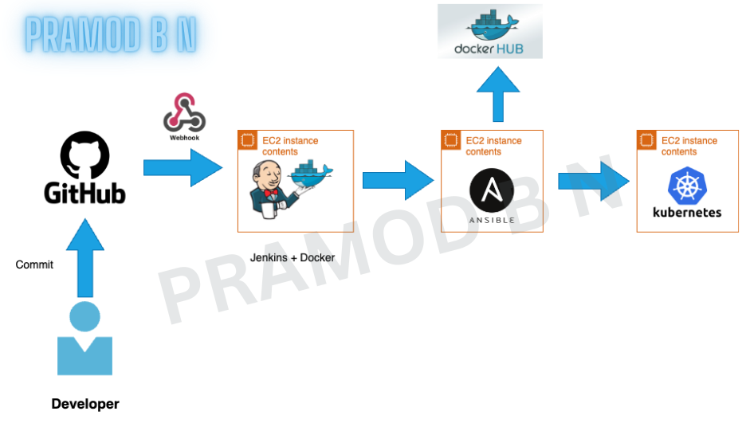

<h1 align="center">Hi 👋, I'm PRAMOD B N</h1>
<h3 align="center">A Versatile Cloud and DevOps Engineer</h3>

  

<h3 align="left">Certifications </h3>

<h3>Skills Summary</h3>
<h4>DevOps Tools</h4>

<h4>Programming Languages/Frameworks</h4>

<h4>Soft Skills</h4>

---

# 

##  

---

##  

---

##  

---

##  

  
  
  
  

---

##  

  
  

---

##  

---

